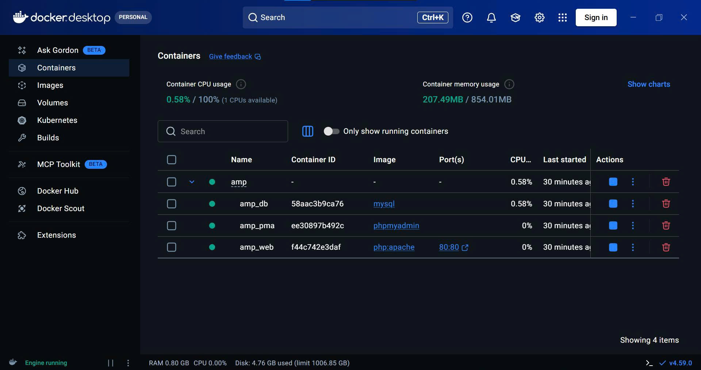

# Pure AMP Docker (Apache + PHP + MySQL + phpMyAdmin)




A **minimal, clean AMP stack** using Docker for **local development and learning**.  
The repository includes a **ready-to-run structure** — just clone and start.

⚠️ **Local use only. Not for production.**

---

## Goals

- Run PHP on **Apache (port 80)**
    
- MySQL `root` **without password** (local only)
    
- phpMyAdmin: [http://localhost/phpmyadmin](http://localhost/phpmyadmin)
    
- **Single port 80**, no extra ports exposed
    

---

## Requirements

- Windows 10/11
    
- Docker Desktop (running)
    

Check:

```bash
docker version
```

---

## Clone

```bash
git clone https://github.com/Namtran592005/docker-amp.git
```

---

## Structure

```
.
├─ docker-compose.yml
├─ apache/phpmyadmin.conf
└─ www/index.php
```

---

## Run

```bash
docker compose down -v
docker compose up -d
```

---

## Access

- PHP site: [http://localhost](http://localhost/)
    
- phpMyAdmin: [http://localhost/phpmyadmin](http://localhost/phpmyadmin)
    

✔ No password  
✔ Port 80 only

---

## Stop / Clean

```bash
docker compose down
docker compose down -v
```

---

## Notes

- MySQL `root` has no password
    
- For learning, testing, student projects
    
- Do not expose publicly
    
- Port 3306 is not published
    

---

## Production

- Set MySQL passwords
    
- Do not expose phpMyAdmin
    
- Use proper VPS/Linux setup
    

---

## Quick Summary

- Clone repo
    
- `docker compose up -d`
    
- Visit `http://localhost`
    
- DB at `/phpmyadmin`
    

Designed to be **simple, correct, and easy to extend**.

---

---

# AMP Docker thuần (Apache + PHP + MySQL + phpMyAdmin)


Stack AMP **tối giản, gọn, đúng bản chất Docker** cho **học tập và phát triển local**.  
Repo đã có **sẵn cấu trúc**, clone về là chạy.

⚠️ **Chỉ dùng local. Không dùng production.**

---

## Mục tiêu

- PHP chạy trên **Apache (cổng 80)**
    
- MySQL `root` **không mật khẩu** (local)
    
- phpMyAdmin: [http://localhost/phpmyadmin](http://localhost/phpmyadmin)
    
- **Chung cổng 80**, không mở port phụ
    

---

## Yêu cầu

- Windows 10/11
    
- Docker Desktop đang chạy
    

Kiểm tra:

```bash
docker version
```

---

## Clone repo

```bash
git clone https://github.com/Namtran592005/docker-amp.git
```

---

## Cấu trúc

```
.
├─ docker-compose.yml
├─ apache/phpmyadmin.conf
└─ www/index.php
```

---

## Chạy

```bash
docker compose down -v
docker compose up -d
```

---

## Truy cập

- Website PHP: [http://localhost](http://localhost/)
    
- phpMyAdmin: [http://localhost/phpmyadmin](http://localhost/phpmyadmin)
    

✔ Không mật khẩu  
✔ Chung cổng 80

---

## Dừng / Xoá

```bash
docker compose down
docker compose down -v
```

---

## Lưu ý

- MySQL `root` không mật khẩu
    
- Chỉ dùng học tập, test, đồ án
    
- Không public ra ngoài
    
- Không mở port 3306
    

---

## Khi dùng thật

- Bắt buộc đặt mật khẩu MySQL
    
- Không public phpMyAdmin
    
- Hoặc dùng VPS/Linux chuẩn
    

---

## Tóm tắt

- Clone repo
    
- `docker compose up -d`
    
- Truy cập `http://localhost`
    
- Quản lý DB tại `/phpmyadmin`
    

Thiết kế theo hướng **dễ hiểu – gọn – chuẩn**, phù hợp người mới và có thể mở rộng sau.
